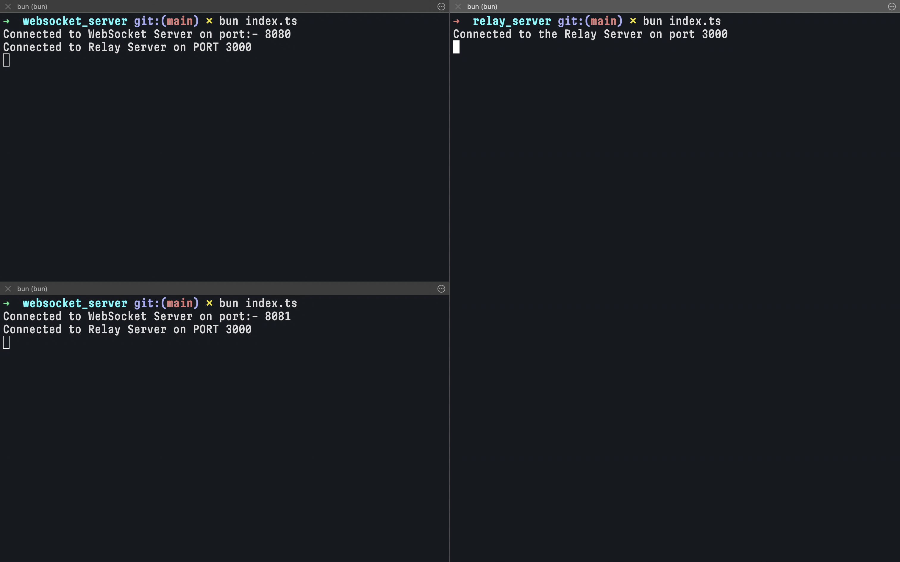
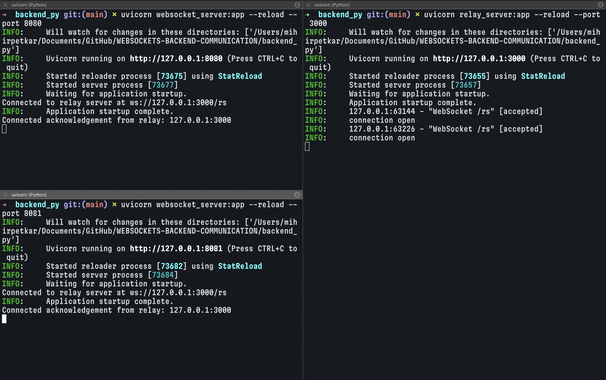
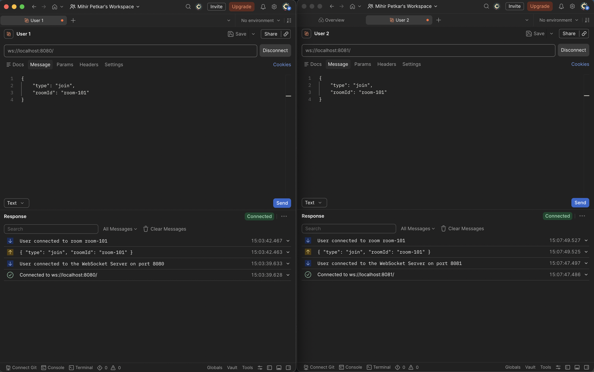
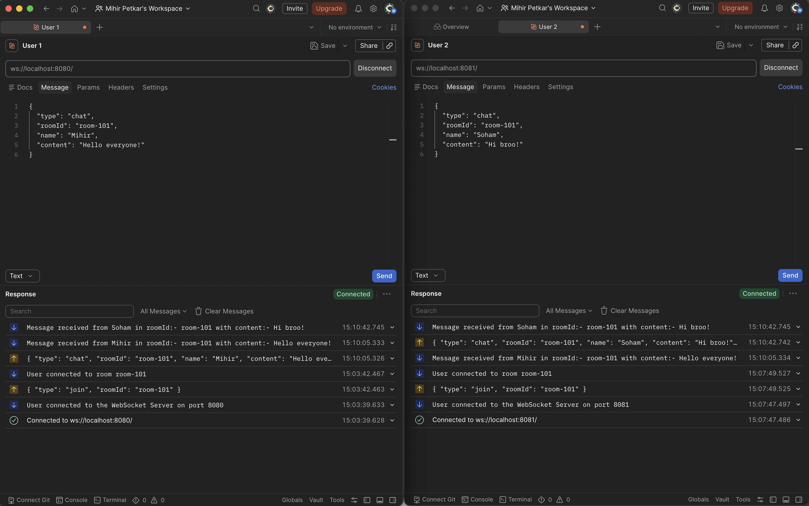
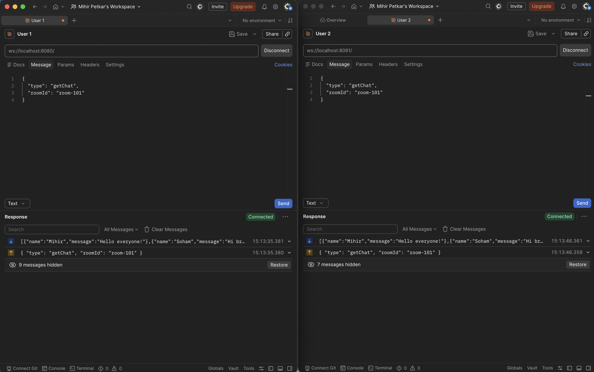

# WebSockets Multi-Backend Communication System

This repository implements a multi-backend WebSocket room-based chat architecture. The system enables real-time client communication across horizontally scaled backend servers by using a central **Relay Server** to broadcast messages.

It contains two complete backend implementations:

1. **JavaScript Backend** (powered by Bun, TypeScript, and `ws`)
2. **Python Backend** (powered by FastAPI, Uvicorn, `websockets`, and Pydantic)

---

## Table of Contents

1. [System Architecture & Working Principles](#system-architecture--working-principles)
2. [File Directory Structure](#file-directory-structure)
3. [JavaScript (JS) Backend Setup & Usage](#javascript-js-backend-setup--usage)
   - [Prerequisites & Installation](#prerequisites--installation)
   - [Starting the Services](#starting-the-services)
4. [Python (Py) Backend Setup & Usage](#python-py-backend-setup--usage)
   - [Prerequisites & Installation](#prerequisites--installation-1)
   - [Starting the Services](#starting-the-services-1)
5. [JSON Protocol / Message Formats](#json-protocol--message-formats)
6. [Postman Testing Guide (Step-by-Step)](#postman-testing-guide-step-by-step)
7. [Cross-Compatibility & Technical Nuances](#cross-compatibility--technical-nuances)

---

## System Architecture & Working Principles

In a typical WebSocket setup, clients connect to a single server. If you spawn multiple instances of a WebSocket server to scale, clients on Server A cannot directly message clients on Server B because their TCP/WebSocket connections are isolated to different server processes.

This project solves that isolation by using a **Relay Server**:

```
     Client A (Postman)                  Client B (Postman)
             | ws                                | ws
             v                                   v
   +--------------------+              +--------------------+
   |  WebSocket Server  |              |  WebSocket Server  |
   |     (Port 8080)     |              |     (Port 8081)     |
   +----------+---------+              +----------+---------+
              |                                   |
              | ws (relay connection)             | ws (relay connection)
              +-----------------+   +-------------+
                                |   |
                                v   v
                      +-------------------+
                      |   Relay Server    |
                      |    (Port 3000)    |
                      +-------------------+
```

### Detailed Flow:

1. **WebSocket Server Bootstrapping**: When a WebSocket Server starts up, it automatically establishes a persistent outgoing WebSocket connection (as a client) to the central **Relay Server** (running on port `3000`).
2. **Client Connections**: Users (clients like Postman, frontends) connect directly to any of the WebSocket servers (e.g. running on port `8080`).
3. **Room Subscription (`join`)**: A client sends a `join` message requesting to enter a specific `roomId`. The WebSocket server registers the client's connection in its local memory structure under that room.
4. **Message Publishing (`chat`)**: When a client sends a message, their host WebSocket server forwards it to the central Relay Server.
5. **Relay Broadcasting**: The Relay Server receives the chat payload and broadcasts it to _all_ connected WebSocket servers.
6. **Local Dispatching**: Each WebSocket server receives the relayed chat message, checks if the corresponding `roomId` exists locally, and forwards the message to all clients connected to that room on _their_ specific instance.

---

## File Directory Structure

```
.
├── README.md                 # Root documentation (this file)
├── backend_js/               # JavaScript/TypeScript implementation
│   ├── relay_server/         # Relay server (Bun + ws)
│   │   ├── index.ts          # Relay server main code
│   │   ├── package.json
│   │   └── tsconfig.json
│   └── websocket_server/     # WebSocket client-facing server (Bun + ws)
│       ├── index.ts          # Client WebSocket server main code
│       ├── package.json
│       └── tsconfig.json
└── backend_py/               # Python implementation
    ├── relay_server.py       # Relay server (FastAPI)
    └── websocket_server.py   # Client WebSocket server (FastAPI + websockets library)
```

---

## JavaScript (JS) Backend Setup & Usage

The JavaScript backend is built to run on the high-performance **Bun** runtime.

### Prerequisites & Installation

1. Install **Bun** if you haven't already:
   ```bash
   curl -fsSL https://bun.sh/install | bash
   ```
2. Navigate to each directory and install dependencies:

   ```bash
   # Install Relay dependencies
   cd backend_js/relay_server
   bun install

   # Install WebSocket server dependencies
   cd ../websocket_server
   bun install
   ```

### Starting the Services

Always start the Relay Server first so that the WebSocket server can connect to it on startup.

1. **Start the Relay Server**:

   ```bash
   cd backend_js/relay_server
   bun run index.ts
   ```

   _Console output:_ `Connected to the Relay Server on port 3000`

2. **Start the WebSocket Server**:
   ```bash
   cd backend_js/websocket_server
   bun run index.ts
   ```
   _Console output:_
   ```text
   Connected to WebSocket Server on port:- 8080
   Connected to Relay Server on PORT 3000
   ```



---

## Python (Py) Backend Setup & Usage

The Python backend is built using **FastAPI** (with Uvicorn) for the HTTP/WebSocket endpoints and the `websockets` package for managing outgoing client connections to the relay.

### Prerequisites & Installation

1. Ensure Python 3.10+ is installed.

2. Install the required dependencies:
   ```bash
   pip install fastapi uvicorn websockets pydantic
   ```

### Starting the Services

1. **Start the Relay Server**:

   ```bash
   cd backend_py
   uvicorn relay_server:app --port 3000
   ```

   _Console output will display Uvicorn running on port 3000._

2. **Start the WebSocket Server**:
   ```bash
   cd backend_py
   # We use port 8080 to match the JS default, or you can run on 8000
   uvicorn websocket_server:app --port 8080
   ```
   _Console output will display:_
   ```text
   Connected to relay server at ws://127.0.0.1:3000/rs
   ```



---

## JSON Protocol / Message Formats

All communication between clients, backend servers, and the relay server is conducted via JSON-formatted text messages.

### 1. Join Room (`join`)

Sent by a client to join a specific room.

- **Payload**:
  ```json
  {
    "type": "join",
    "roomId": "room-101"
  }
  ```
- **Server Action**: Registers client socket connection, notifies relay (in JS backend), and responds with a success message to the joining client:
  `User connected to room room-101`



### 2. Send Message (`chat`)

Sent by a client to publish a message to a room.

- **Payload**:
  ```json
  {
    "type": "chat",
    "roomId": "room-101",
    "name": "Mihir",
    "content": "Hello everyone!"
  }
  ```
- **Server Action**: Forwards this event to the Relay Server. The Relay Server broadcasts it to all WebSocket servers, which then deliver it to all clients in `room-101`.
- **Client Broadcast Received**:
  `Message received from Mihir in roomId:- room-101 with content:- Hello everyone!`



### 3. Get Chat History (`getChat`)

Sent by a client to retrieve cached messages in a room.

- **Payload**:
  ```json
  {
    "type": "getChat",
    "roomId": "room-101"
  }
  ```
- **Server Response**:
  ```json
  [
    {
      "name": "Mihir",
      "message": "Hello everyone!"
    }
  ]
  ```
  

---

## Postman Testing Guide (Step-by-Step)

Postman has built-in support for WebSockets, making it easy to test room join/leave and chat workflows.

### Step 1: Open a WebSocket Request in Postman

1. Open Postman.
2. Click **New** -> **WebSocket**.
3. Select **Raw** WebSocket (not Socket.IO).

### Step 2: Establish a Connection

1. Set the URL to:
   ```text
   ws://localhost:8080/ws
   ```
   _(Note: For the JS server, the path is optional, but `ws://localhost:8080` works. For the Python FastAPI server, the exact path must be `ws://localhost:8080/ws`)_
2. Click **Connect**.
3. You should see a response in the log:
   - _JS_: `User connected to the WebSocket Server on port 8080`
   - _Python_: `Websocket connected on 127.0.0.1:8080`

### Step 3: Join a Room

To receive messages in a room, you must subscribe/join first.

1. In the **Message** editor, switch the format dropdown to **JSON**.
2. Enter the following payload:
   ```json
   {
     "type": "join",
     "roomId": "gamers-lounge"
   }
   ```
3. Click **Send**.
4. You should see a receipt message:
   `User connected to room gamers-lounge` (or `User connected to roomId:- gamers-lounge` in Python).

### Step 4: Simulate Multi-Client Chat (Open Client 2)

1. Open a **second** WebSocket tab in Postman.
2. Connect to `ws://localhost:8080/ws`.
3. Join the same room:
   ```json
   {
     "type": "join",
     "roomId": "gamers-lounge"
   }
   ```
4. Now, from **Client 2**, send a chat message:
   ```json
   {
     "type": "chat",
     "roomId": "gamers-lounge",
     "name": "Alice",
     "content": "Hey team, ready to play?"
   }
   ```
5. Click **Send**.
6. Switch back to **Client 1's** tab. You will see:
   `Message received from Alice in roomId:- gamers-lounge with content:- Hey team, ready to play?`

### Step 5: Retrieve Room Chat History

1. Send the following request from either client:
   ```json
   {
     "type": "getChat",
     "roomId": "gamers-lounge"
   }
   ```
2. Click **Send**.
3. You will receive a JSON array containing the history of messages for `gamers-lounge`:
   ```json
   [
     {
       "name": "Alice",
       "message": "Hey team, ready to play?"
     }
   ]
   ```

---

## Cross-Compatibility & Technical Nuances

### Port Configurations

- Both implementations default the **Relay Server** to port `3000` and the client-facing **WebSocket Server** to port `8080`.
- If you want to run both the JavaScript and Python servers simultaneously to test inter-language relay synchronization, configure the Python WebSocket server to run on a different port (e.g. `8081`):
  ```bash
  uvicorn websocket_server:app --port 8081
  ```
  Now, a client connected to the JS server on `8080` can chat with a client connected to the Python server on `8081` in real-time!

### Endpoint Path Requirements

- **JavaScript Relay**: Employs raw `ws` and does not enforce a route path (e.g., `ws://localhost:3000` works fine).
- **Python Relay**: Built with FastAPI. It maps WebSocket routing specifically to `/rs`, meaning connection URLs must explicitly target `ws://localhost:3000/rs`.
- Ensure your WebSocket server source file configuration points to the correct relay URL based on which relay backend you are running:
  - In `backend_js/websocket_server/index.ts`: uncomment line 7 for the JS relay, or line 10 for the Python relay.
  - In `backend_py/websocket_server.py`: uncomment line 15 for the JS relay, or line 16 for the Python relay.
